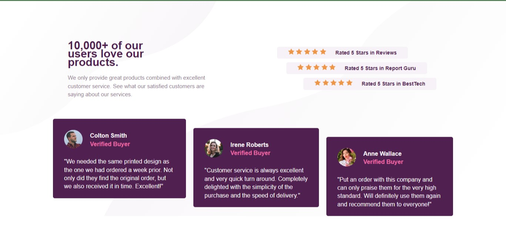

## Table of contents

- [Overview](#overview)
  - [Screenshot](#screenshot)
  - [Links](#links)
- [My process](#my-process)
  - [Built with](#built-with)
  - [What I learned](#what-i-learned)
  - [Continued development](#continued-development)
  - [Useful resources](#useful-resources)
- [Author](#author)
- [Acknowledgments](#acknowledgments)


## Overview

This is a solution to the [3-column preview card component challenge on Frontend Mentor](https://www.frontendmentor.io/challenges/3column-preview-card-component-pH92eAR2-). This project was assigned by [web3bridge](https://www.web3bridge.com/) for Web2 cohort VII.

### Screenshot




### Links

- Live Site URL: (https://meelynda.github.io/Social-Proof/)

## My process

### Built with

- Semantic HTML5 markup
- CSS custom properties
- Flexbox
- Media Query

### What I learned

While working on this project i learnt more on using flexbox, psuedo class selector, media query and how to add two images to a background. 
Below are code samples of my project:

```html
    <div class="box-1">
        <div class="customer">
            
            <div>
               <h4>Colton Smith <span>Verified Buyer</span></h4>
            </div>
        </div>
    </div>
```
```css
{
 .box-1: first-child{
    align-self: flex-start;
}
 .box-1:last-child{
    align-self: flex-end;
}
}
```

### Continued development

I will be focusing next on learning more about media query and css grid to perfect my techniques.  

### Useful resources

- (https://www.w3schools.com/css/css_rwd_mediaqueries.asp) - This helped me on media query.
- (https://www.w3schools.com/css/css3_backgrounds.asp) - This is an amazing article which helped me finally understand how to  add two images on a background. I'd recommend it to anyone still learning this concept.

## Author

- Twitter - [LyndaObiz](https://www.twitter.com/LyndaObiz)

## Acknowledgments

Thanks to my tutor - [Adetutu Gbangbola](https://github.com/Adetutu777)  and - [Web3Bridge](https://www.web3bridge.com) community for this opportunity.